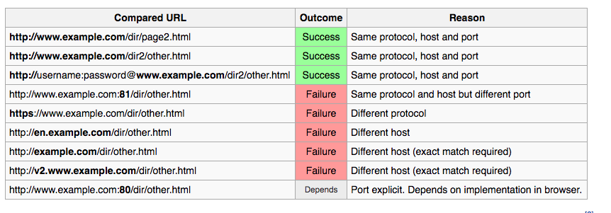
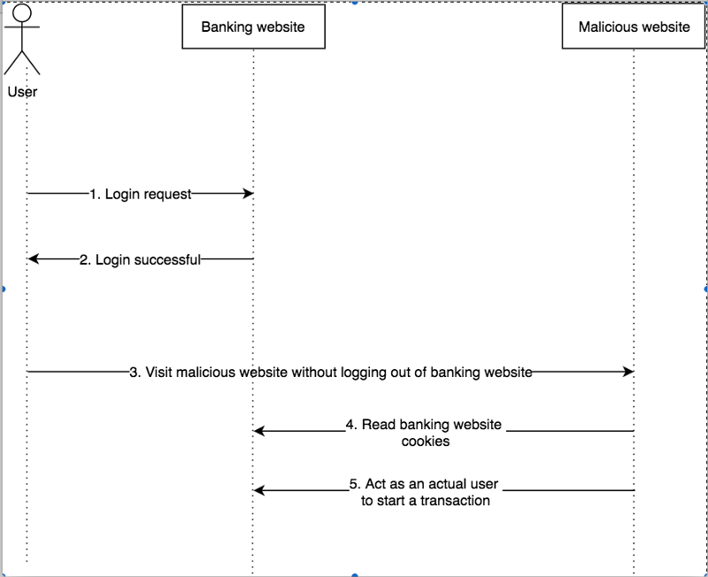
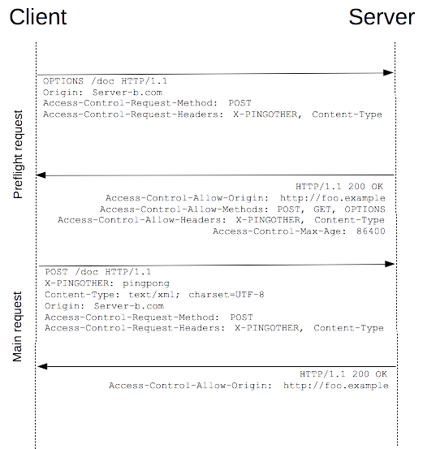
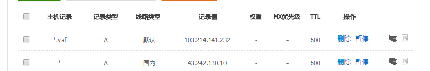

name:inverse
class: center, middle,inverse
layout: true

---

# 跨域

Fighting
???

* 为什么要知道跨域 :）发现很多做前端开发的，对于自己息息相关的跨域问题（后端不关心、APP 不关心、客户端也不关心）一知半解，有些甚至是全然不知。
* 为什么要知道如何跨域 不要把自己框死在前端。缓存、http 协议、业务逻辑、后端开发、数据库、服务器配置等等，都要熟悉。

本次分享旨在由浅入深，让之前不懂跨域的小伙伴知道跨域是怎么回事，让已经知道跨域概念的小伙伴，知道如何自己配置跨域，再然后与深谙跨域之道的小伙伴探讨一下一些我的思考。

当我们在聊跨域的时候，我们在聊什么？

* 报错 [demo1](/demo/1.html)
* JSONP (多少人知道原理)
* CORS(Cross-Origin Resource Sharing)

---

* ###同源策略

--

* ###限制原因

--

* ###HTTP 协议

--

* ###如何跨域

--

* ###跨域安全

???

为什么要从这些方面聊跨域问题

学习任何技术都应该以如此心态及规划

在知识广度够的情况下，加深深度。不然说起跨域，只知道 jsonp

以 promise 为例讲解如何拓宽知识深度；
promise 不是仅仅那几个 api；
promise 译作承诺 解决信任问题，未来异步编程的基石；
callback 可调、可不调、调几次、异步调、同步调；

---

# 同源策略

---

.left-column[

## 同源

]
.right-column[
.left[

> 如果两个页面的协议、域名、端口都相同，则两个页面具有相同的源。

]
]

---

.left-column[

## 同源

## 策略

]
.right-column[
.left[

> 同源策略限制了从同一个源加载的文档或脚本如何与来自另一个源的资源进行交互。

* 数据访问
* 网络访问

]]

???

表现在：

本地数据访问控制：

* cookie
* storage
* indexDB
* DOM

网络访问控制

* web 字体
* canvas 加载图片
* webGL

（JSONP 算是一种取巧）
img、script、link、video、object、iframe

* [网络访问 demo](/demo/1.html)
* [Dom 访问 demo](/demo/2.html)
* [资源访问 demo](/demo/3.html)

---

.left-column[

## 同源

## 策略

## 🌰

]
.right-column[
.left.right-img[

URL:http://www.example.com/dir/page.html



]
]

---

# 限制原因

???

集思广益参与讨论

安全？怎么不安全？

---

.left-column[

## 假如

]
.right-column[
.left.right-img[



]
]

---

.left-column[

## 假如

## 疑惑

]
.right-column[
.left[

* 以上的攻击基于 cookie （本地数据）的跨域共享，既然是 cookie 的不安全导致了跨域的不安全，仅仅禁止跨域共享 cookie 就好了，为何要限制跨域网络的访问？
* 跨域限制存在的情况下，跨域请求是否真的无法发送？

]
]

???

* ### ip 鉴权场景，内网系统，有一个电脑可以上网，就能拿到所有的内网资源
* ### 免费的分布式爬虫

### 跨域请求是否真的无法发送？ 是，也不是

* 资源加载 img,css,script,video...
* form 表单提交 [form 跨域提交](/demo/5.html)
* 普通 ajax 请求 [跨域是否会发送请求成功 demo](/demo/7.html)

抓包演示

https 向 http 的请求会被浏览器拦截(其实也是 csp 策略，只是浏览器默认启用了)

csp 策略限制的情况下，请求不会发送

~~~ 非简单请求，在 option 请求通过之前，不会到达后端服务 ~~~

---

# HTTP 协议

???

* [RFC 2616 (http/1.1)](https://tools.ietf.org/html/rfc2616)
* [RFC 7540 (http/2)](https://tools.ietf.org/html/rfc7540)
* [HTTP 权威指南](https://item.jd.com/11056556.html)
* [http2 Demo](https://http2.akamai.com/demo)

- 形态
- 连接
- 网关
- 认证
- 代理
- 缓存
- 安全
- 编码

不做细致讲解

---

.left-column[

## 协议

]
.right-column[
.left.right-img[

]
]

???

喝水、闭嘴、揉腿、亲一口，老鬼

[视频链接 8:15 秒处](http://tv.cntv.cn/video/C38143/35c0812421a33ddd958986650a4e5c44)

---

.left-column[

## 协议

## 请求

]
.right-column[
.left[

```
GET /v1/getUserInfo HTTP/1.1
Host: fighting.com
User-Agent: Mozilla/5.0 (Windows NT 10.0; Win64; x64) AppleWebKit/537.36 (KHTML, like Gecko) Chrome/66.0.3359.170 Safari/537.36
Accept: text/html,application/xhtml+xml,application/json;q=0.9,*/*;q=0.8
Accept-Language: en-us,en;q=0.5
Accept-Encoding: gzip,deflate
Accept-Charset: ISO-8859-1,utf-8;q=0.7,*;q=0.7
Connection: keep-alive
Referer: http://fighting.com/examples/access-control/simpleXSInvocation.html
Origin: http://fighting.com
```

]
]

---

.left-column[

## 协议

## 请求

## 响应

]
.right-column[
.left[

```
HTTP/1.1 200 OK
Date: Mon, 01 Dec 2008 00:23:53 GMT
Server: Apache/2.0.61
Access-Control-Allow-Origin: *
Keep-Alive: timeout=2, max=100
Connection: Keep-Alive
Transfer-Encoding: chunked
Content-Type: application/json

{"msg":"success","code":10}
```

]
]

---

# 如何跨域

--

### CORS(Cross-Origin Resource Sharing)

???

[cors 兼容性](https://caniuse.com/#search=cors)

被滥用的 jsonp
被滥用的 cookie

* JSONP（无法 post）
* location.hash
* document.domain(主域相同)
* document.name
* navigator 跨域 （IE6、7）
* message 机制 (HTML5)
* flash
* ...

跨域只是针对浏览器的策略，因为浏览器是公共环境。

---

.left-column[

## 请求头

]
.right-column[
.left[

* Access-Control-Request-Headers
* Access-Control-Request-Method

  ]]

???

这两个请求头只出现在预检请求中，也就是我们经常碰到的 options 请求

浏览器自发行为

---

.left-column[

## 请求头

## 响应头

]
.right-column[
.left[

* Access-Control-Allow-Headers
* Access-Control-Request-Method
* Access-Control-Allow-Origin
* Access-Control-Expose-Headers
* Access-Control-Max-Age
* Access-Control-Allow-Credentials

]]

???

* 除了 Access-Control-Allow-Origin，其它的响应头均未实现\*号
* Access-Control-Allow-Headers 中以下是默认支持的，不需要列出来：Accept、Accept-Language、Content-Language、Content-Type。但 Content-Type 只能是 application/x-www-form-urlencoded、multipart/form-data 或 text/plain
* Access-Control-Allow-Credentials true/false 区分大小写
* Access-Control-Max-Age 单位为秒
* Access-Control-Expose-Headers 默认只能访问 Cache-Control、Content-Language、Content-Type、Expires、Last-Modified、Pragma

---

# 预检请求

--

### preflight

---

.left-column[

## 描述

]
.right-column[
.left[

> 跨域资源共享标准新增了一组 HTTP 首部字段，允许服务器声明哪些源站有权限访问哪些资源。另外，规范要求，对那些可能对服务器数据产生副作用的 HTTP 请求方法（特别是 GET 以外的 HTTP 请求，或者搭配某些 MIME 类型的 POST 请求）（非简单请求），浏览器必须首先使用 OPTIONS 方法发起一个预检请求（preflight request），从而获知服务端是否允许该跨域请求。服务器确认允许之后，才发起实际的 HTTP 请求。在预检请求的返回中，服务器端也可以通知客户端，是否需要携带身份凭证（包括 Cookies 和 HTTP 认证相关数据）。

]]

---

.left-column[

## 描述

## Simple Requests

]
.right-column[
.left[
满足如下条件：

* 请求方法：GET、HEAD、POST
* 自定义头：Accept、Accept-Language、Content-Language、Content-Type
* Content-Type 仅限值：text/plain、multipart/form-data、application/x-www-form-urlencoded
* 请求中的任意 XMLHttpRequestUpload 对象均没有注册任何事件监听器
* 请求中没有使用 ReadableStream 对象。

]]

???

* ReadableStream 只有 chrome 实现了
* XMLHttpRequestUpload 对象可以使用 XMLHttpRequest.upload 属性访问。

---

.left-column[

## 描述

## Simple Requests

## Preflight

]
.right-column[
.left[

    

]]

???

[触发 option 请求 demo](/demo/7.html)

预检请求被重定向会出错

预检请求需要返回 200 或 204，更推荐 204 No Content, douban 这里直接让预检进入了后端服务

[跨域 ajax 不报错 demo](/demo/9.html)

我们使用 Service workers 缓存 cdn 上的静态资源，但是跨域报错。
fetch mode https://developer.mozilla.org/zh-CN/docs/Web/API/Request/mode

Cache 相关 API https://developer.mozilla.org/zh-CN/docs/Web/API/Cache

SErvice workers https://developer.mozilla.org/zh-CN/docs/Web/API/Service_Worker_API

SErvice workers 未来很有想象空间的东西

---

#跨域安全

???

同源策略的初衷是为了安全，但牺牲了很多便捷性，然后有了跨域，跨域撕开了一道口子，如何保证安全？安全是头等大事，如果滥用跨域导致安全问题，那就得不偿失了。

* Access-Control-Allow-Origin：\* 与之前讨论的浏览器默认允许跨域，但不携带 cookie 一样
* Access-Control-Allow-Credentials:true 允许携带 cookie 的情况下，上面选项不能设置为\* 为什么？ （：为安全操碎了心的委员会 [不安全配置出错 demo](/demo/8.html)
* form 表单跨域提交安全问题
* [CSP 策略](https://developer.mozilla.org/zh-CN/docs/Web/HTTP/Headers/Content-Security-Policy__by_cnvoid)
* JSONP 的滥用，危险点在哪，如何防，是否 script 标签一定会发送 cookie？ 先看实例--> [JSON 安全问题 Demo](/demo/6.html) （crossorigin="anonymous"，传递错误的值也不会发送 cookie）

JSONP 防御可从 referer 来展开讲，以[什么值得买](https://www.smzdm.com)的个人信息接口展开来讲

CSP 策略可以到 twitter 演示

百度搜 CSP 阮一峰

* referer 匹配域名
* referer 未考虑空 ,人造空 referer [demo4](/demo/4.html), [Referrer-Policy](https://developer.mozilla.org/zh-CN/docs/Web/HTTP/Headers/Referrer-Policy)
* Content-Type: application/json; charset=utf-8 +/v8 触发 utf7-BOM
  

---

.right-column[
.left[

```
    const review = [
        '何为同源策略',
        '为何限制跨域',
        'HTTP协议',
        'CORS',
        '安全'
    ]
```

]]

---

```
    console.log("Thanks!");
```

```

```
